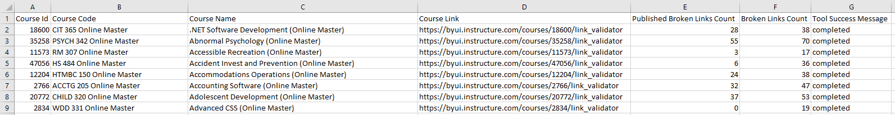

# Project Capture Document for Canvas Link Validator Runner
#### *Author: Ryan Gewondjan*
#### *Stakeholder(s): Corey Moore*
#### *Date: 2019 March 15, 04:30 PM*

## Background

Currently to check for broken links in courses, Corey's team needs to click into each course, navigate to the course link validator tool, run the tool and view the results.  Getting a report of all broken links in all courses will take a long time. This tool is to automate that process.

-----

## Definition of Done

A tool will exist that searches all the courses in the BYU-Idaho Online Master Courses Account (sub account Master Courses) for broken links and returns a CSV report with the number of broken links per each course.

-----

# Requirements

### General Requirements

A report generated that has the number of broken links in each course (for BYU-Idaho Online Master Courses Account, Master Courses Sub Account).

### Input Requirements

#### Source of Inputs

Account Id from stakeholder. (The account id will be used to get the inputs directly from canvas (api call to get the list of courses)).

#### Definition of Inputs

Account ID given to canvas. (Which will be used to get the list of courses from canvas).

When the course ID is given to this canvas api: https://byui.instructure.com/api/v1/courses/:courseId/link_validation

The following object is returned:

Making a post request to https://byui.instructure.com/api/v1/courses/:courseId/link_validation runs the broken link validator for the specific course.
Making a get request to https://byui.instructure.com/api/v1/courses/:courseId/link_validation gets the information that comes from running the validator.

---

### Output Requirements
#### Destination

The tool will be given to Corey Moore to use to generate CSV's at will.

#### Definition of Outputs

CSV document with column headers:

Course Code, Course Name (which will be a link to the course validator tool page for that course), number of broken links.

Pre CSV, the output is like this: 

The CSV will look like this:

---

### User Interface

#### Type:

CLI Account ID as optional input. The account number defaults to the account number corresponding to BYU-Idaho Online Master Courses Account (sub account Master Courses).

-----

## Expectations

### Timeline

No rush, but should have within two weeks tentative deadline (March 29th)

### Best Mode of Contact

Slack/In Person

### Next Meeting

Not set.

### Action Items
<!-- Recap Meeting -->
#### TechOps
Nothing outside of normal design process.

#### Stakeholder
Nothing
-----

#### *Approved By: Aaron Shiffler*
#### *Approval Date: 3/15/2019*
